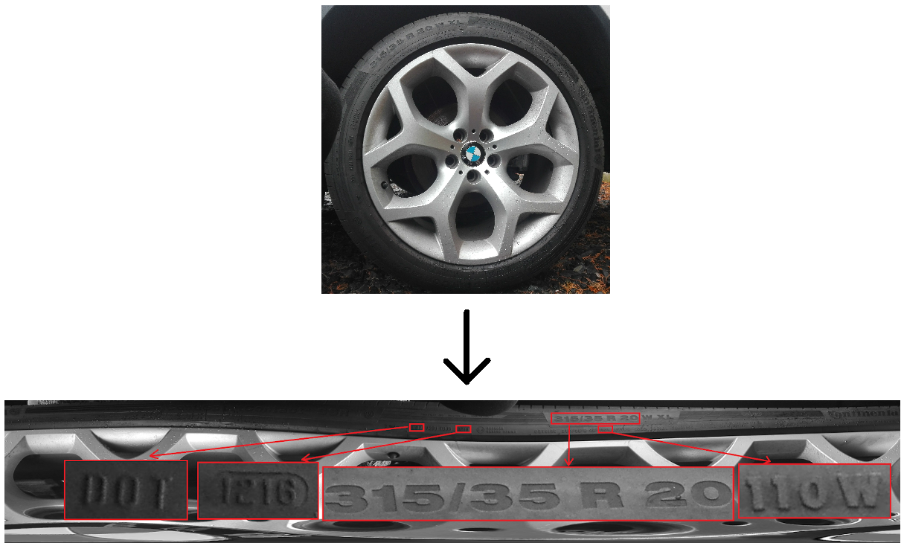

# Goal of the project

Goal of the project is to detect tyre markings.

# 1. Change of coordinates system.

The first step is to change the coordinate system from cartesian to polar. It can be interpreted as unscrewing the image. After the change of the coordinate system, the tyre markings are arranged (approximately) horizontally parallel to each other.

 

 

### Duration of coordinate system change on CPU i5-6300HQ:

| Resolution [pix] | Loading time [s] | Coordinate change time [s] | Saving time [s] | Total time [s] |
| :--------------: | :--------------: | :------------------------: | :-------------: | :------------: |
|    3104x3104     |       3.91       |            2.99            |      9.44       |     16.35      |
|    2500x2500     |       2.67       |            1.87            |      6.48       |     11.04      |
|    2000x2000     |       1.81       |            1.19            |      4.02       |      7.03      |
|    1500x1500     |       0.96       |            0.65            |      2.52       |      4.15      |
|    1000x1000     |       0.45       |            0.27            |      1.24       |      1.98      |

# 2. Text fields detection.

# 3. Markings detection.
